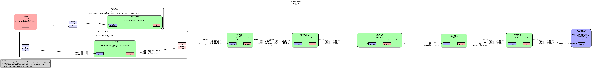

# gst-torch
### PyTorch plugins for GStreamer in Rust




Not only are the networks CUDA-enabled, but the pipeline has also been accelerated with CUDA tensors.

Source for [Monocular Depth](src/monodepth.rs)

Depends on CUDA-enabled LibTorch:

- Get `libtorch` from the
[PyTorch website download section](https://pytorch.org/get-started/locally/)
- Set env `${LIBTORCH}`

### Test with any of the following:
```
./test_dashboard_file.sh
./test_dashboard_preview.sh
./test_monodepth_preview.sh
```


----------------------

Built upon the amazing work of:

## Monocular Depth

> **Digging into Self-Supervised Monocular Depth Prediction**
>
> [Clément Godard](http://www0.cs.ucl.ac.uk/staff/C.Godard/), [Oisin Mac Aodha](http://vision.caltech.edu/~macaodha/), [Michael Firman](http://www.michaelfirman.co.uk) and [Gabriel J. Brostow](http://www0.cs.ucl.ac.uk/staff/g.brostow/)  
>
> [ICCV 2019](https://arxiv.org/abs/1806.01260)

```
@article{monodepth2,
  title     = {Digging into Self-Supervised Monocular Depth Prediction},
  author    = {Cl{\'{e}}ment Godard and
               Oisin {Mac Aodha} and
               Michael Firman and
               Gabriel J. Brostow},
  booktitle = {The International Conference on Computer Vision (ICCV)},
  month = {October},
year = {2019}
}
```

## GStreamer
[GStreamer Plugins in Rust](https://gitlab.freedesktop.org/gstreamer/gst-plugins-rs)

## Rust wrapper for LibTorch
[Tch-rs](https://github.com/LaurentMazare/tch-rs)

